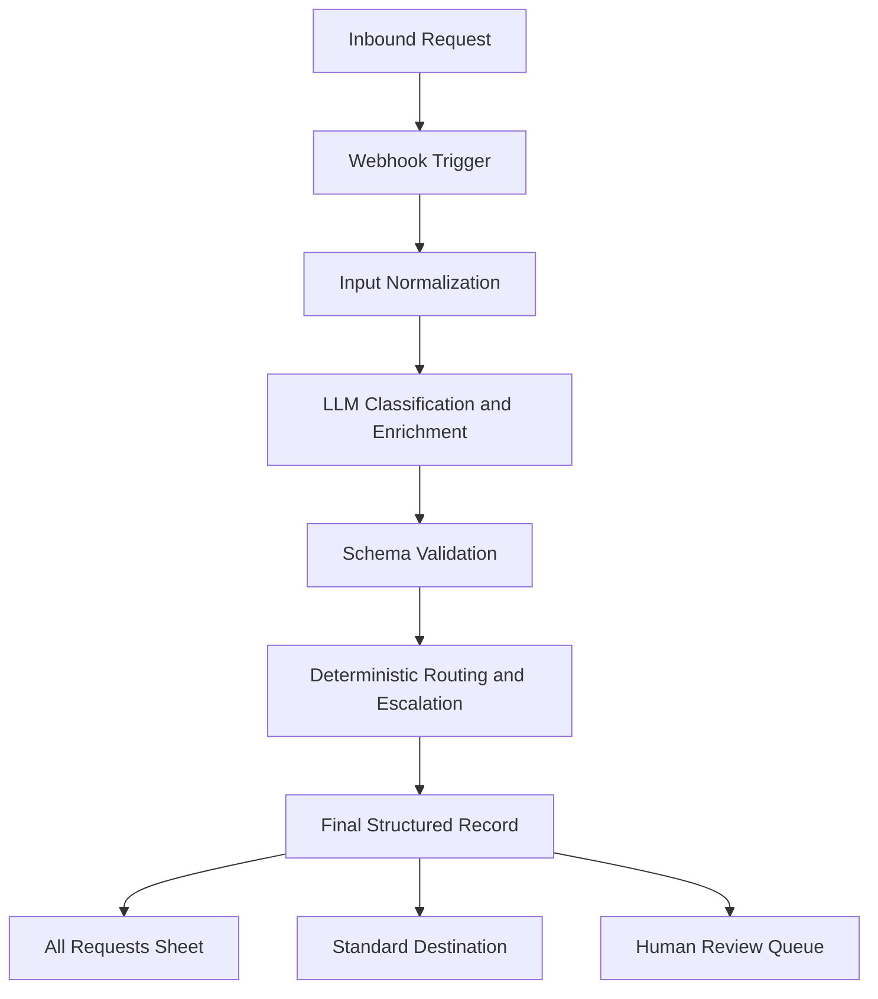

# Architecture Diagram

```mermaid
flowchart TD
    A["Inbound Request"] --> B["Webhook Trigger"]
    B --> C["Input Normalization"]
    C --> D["LLM Classification and Enrichment"]
    D --> E["Schema Validation"]
    E --> F["Deterministic Routing and Escalation"]
    F --> G["Final Structured Record"]
    G --> H["All Requests Sheet"]
    G --> I["Standard Destination"]
    G --> J["Human Review Queue"]
```
